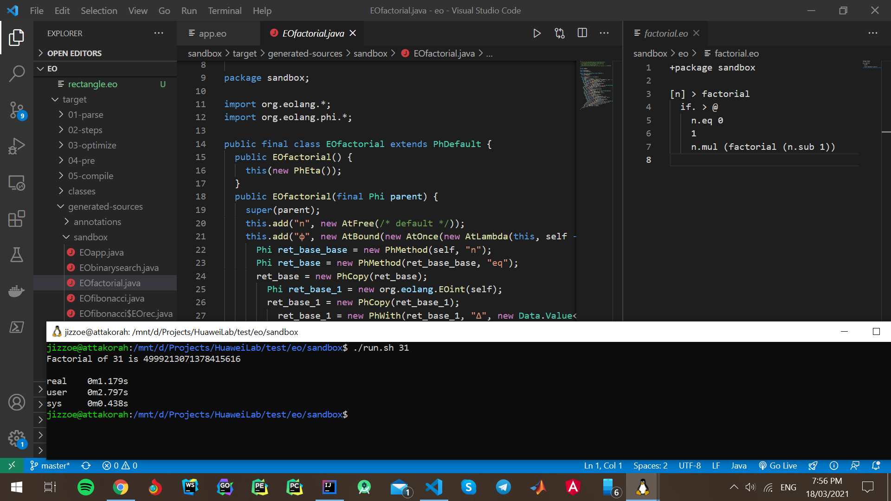
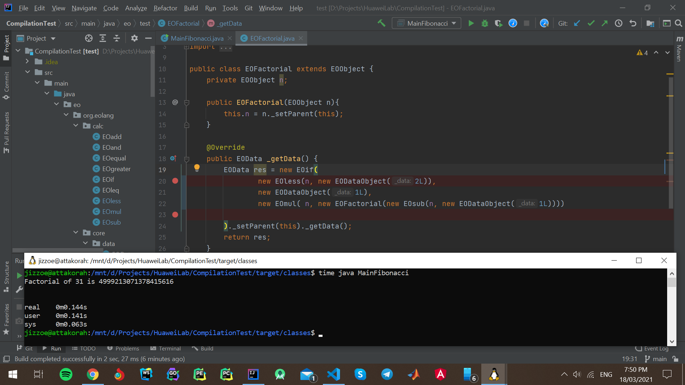

# EO to Java Transpiling Model

## Basic Runtime Classes

| Class | Description    |
|:---|:-----|
| EOObject | Has three main objectives: 1.Instantiate an EO object (i.e. make a copy of it via a constructor) 2.Dataize an EO object 3.Set a parent object 4.Access attributes of an object |
| EOData | Used to store data primitives. |
| EODataObject | A wrapper class to interpret EOData as EOObject |
| EONoData | A primitive class representing the absence of data |

## Mapping EO Entities to Java Code Structures

| EO | Java    |
|:---|:-----|
| Abstraction (introduction of a conceptually new object) | A plain old Java class extending EOObject |
| Application (object copying) | Creating a new class instance |
| A free attribute | A class field that should be sat via the constructor |
| A bound attribute | A separate class with the following naming pattern EObase$EOattr |
| Duck typing | Everything is EOObject. Class fields are accessed via Java Reflection |
| Object dataization | 	Calling _getData() |

### Performance Metrics
 * The solution being proposed is ~17x faster and more efficient.

### The Current (CQFN) Implementation

30th Fibonacci number is 832040 real 1m8,963s
user 1m9,882s
sys 0m1,391s

### The Approach being Proposed
50th Fibonacci number is 12586269025 real 0m0,430s user 0m0,652s sys 0m0,065s

real    0m0,109s 
user    0m0,115s 
sys     0m0,034s 
